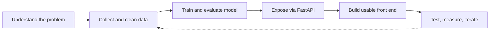

  

 

## 🚀 Professional Summary

> **Computer Science engineering student who turns data into working products.** I combine **machine learning** with **modern web architecture** to build systems people can actually use, from a cricket analytics engine that predicts match outcomes to a platform that simplifies college resource management.

<table>
<tr>
<td align="center" width="25%">

🎓 **Education** B.Tech, Computer Science and Engineering

</td>
<td align="center" width="25%">

🧠 **Focus** Machine Learning, Python, FastAPI

</td>
<td align="center" width="25%">

🔭 **Building** Cric_TR and ClassroomBook

</td>
<td align="center" width="25%">

🤝 **Open to** Internships, entry-level roles, collaboration

</td>
</tr>
</table>

 

## 🎯 What I'm Looking For

- 💼 **Roles:** Internships and entry-level positions in **Machine Learning, Data, or Full-Stack Development**
- 🌍 **Environment:** Teams that value clean code, ownership, and learning on the job
- 🚀 **Goal:** Apply ML and web engineering to products with real users and measurable impact

 

## ⭐ Featured Projects

<table>
<tr>
<td width="50%" valign="top">

### 🏏 [Cric_TR](https://github.com/Akashe123/Cric_TR)
**Cricket Analytics Engine**

An end-to-end machine learning system that predicts match outcomes and player performance, served through a FastAPI backend.

[**View Project →**](https://github.com/Akashe123/Cric_TR)

</td>
<td width="50%" valign="top">

### 📚 [ClassroomBook](https://github.com/Akashe123/classroombook)
**Campus Scheduling and Resource Platform**

An interactive web application for scheduling, room booking, and resource management in colleges, reducing manual coordination.

[**View Project →**](https://github.com/Akashe123/classroombook)

</td>
</tr>
</table>

<b>🧩 See more projects</b>

 

| Project | What it does | Tech |
|:--|:--|:--|
| 📊 [excel-dashboard-builder](https://github.com/Akashe123/excel-dashboard-builder) | Interactive tool to build dynamic dashboard visuals from Excel data | `JavaScript` `HTML` `CSS` |
| 🎨 [Pixel-Art-Maker](https://github.com/Akashe123/Pixel-Art-Maker) | Lightweight app to design and export custom grid-based pixel art | `JavaScript` `HTML` `CSS` |
| 🖼️ [create-a-gif-with-python](https://github.com/Akashe123/create-a-gif-with-python) | Automation script that converts image sequences into animated GIFs | `Python` `PIL` |

 

## ⚙️ How I Build

 

## 🛠️ Tech Stack

  

| Area | Technologies |
|:--|:--|
| **Languages** | Python, JavaScript, HTML5, CSS3 |
| **Backend and APIs** | FastAPI |
| **Machine Learning** | Scikit-learn |
| **Tools** | Git, GitHub, VS Code |

 

## 🌱 Currently Learning

 

## 💡 What I Bring to a Team

<table>
<tr>
<td width="50%" valign="top">

🧠 **Problem-solving mindset** I start with the problem and the data, then choose the right tool.

🏗️ **End-to-end ownership** From model training to API design to a usable front end.

</td>
<td width="50%" valign="top">

📈 **Data-driven thinking** Decisions backed by analytics and measurable outcomes.

🔄 **Fast learner** Continuously upskilling in ML, backend systems, and scalable architecture.

</td>
</tr>
</table>

 

## 📊 GitHub Analytics

 

 

 

 

 

## 📬 Let's Build Something Together

I'm actively looking for opportunities where I can contribute, learn, and grow. If you're hiring or want to collaborate, I'd love to hear from you.

⭐ Thanks for visiting my profile

